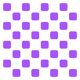
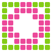

<p align="center">
  &nbsp;&nbsp;
  &nbsp;&nbsp;
  &nbsp;&nbsp;
  &nbsp;&nbsp;
  &nbsp;&nbsp;
  &nbsp;&nbsp;
  &nbsp;&nbsp;
  
</p>

# Pixicon

A pixel grid editor for creating animated SVG icons — in the browser or from the command line.

Paint cells on a grid, slap animations on them, tweak timing and easing per pixel, and export production-ready SVG, CSS, or React components. It's like a tiny After Effects for pixel art, except it actually finishes rendering.

<p align="center">
  
</p>

## What You Get

- **Pixel grid canvas** — click to paint, drag to fill, pick from 4 color palettes (or go rogue with custom hex)
- **11 animation types** — pulse, fade, bounce, spin, shake, wobble, flip, glow, slide-in, typewriter, or none if you're feeling stoic
- **Per-cell animation control** — every single pixel gets its own duration, delay, easing, direction, and iteration count
- **Stagger patterns** — radial, spiral, diagonal, left-to-right, top-to-bottom, or random timing spread across cells
- **Multi-frame support** — build frame sequences for complex animations
- **Live preview** — see your animation running as you build it
- **3 export formats** — inline SVG, CSS/HTML, or a self-contained React component with a `size` prop
- **6 built-in presets** — Spinner, Dots, Bars, Wave, Pulse Grid, Heartbeat — for when you need something *now*
- **Gallery** — save your creations, browse them later, share preview URLs
- **Undo/redo** — up to 50 steps, because mistakes are part of the process

## Quick Start

```bash
npm install
npm run dev
```

That's it. Open the browser. Start painting.

## CLI: `pixicon`

The real fun starts here. Every operation in the web editor is available as a composable CLI command. Pipe JSON through stdin/stdout like a civilized person.

```bash
# create an 8x8 grid, fill a circle, make it red, export as SVG
pixicon grid create --data '{"rows":8,"cols":8}' \
  | pixicon cells fill-pattern --data '{"pattern":"circle","props":{"active":true,"fill":"#ff0000"}}' \
  | pixicon anim stagger --data '{"pattern":"radial","totalTime":0.8}' \
  | pixicon export svg
```

### Commands

| Command | Verbs | What it does |
|---------|-------|--------------|
| `grid` | `create`, `resize` | Spin up a new grid or resize (1–64 rows/cols) |
| `cells` | `set`, `clear`, `query`, `fill-rect`, `fill-pattern` | Paint, erase, query, or batch-fill cells |
| `anim` | `stagger`, `preset` | Apply stagger timing or load a named preset |
| `frame` | `add`, `duplicate`, `remove`, `set-active`, `list` | Multi-frame wrangling |
| `export` | `svg`, `css`, `react`, `all` | Generate production code |
| `describe` | `animation-types`, `easing-options`, `stagger-patterns`, `presets`, `palettes`, `directions`, `fill-modes`, `cell-properties` | List available options (great for scripting) |
| `validate` | — | Check document structure and cell bounds |
| `palette` | — | Dump all color palettes with hex values |
| `gallery` | `save`, `list`, `remove` | Manage saved icons |

### Fill Patterns

`border` · `checkerboard` · `diagonal` · `cross` · `x-mark` · `circle` · `diamond` · `corners`

### Targeting Cells

Commands that operate on cells accept flexible target specs:

- `"*all"` — every cell
- `"*active"` — only painted cells
- `"3-5"` — a single cell at row 3, column 5
- `["0-0", "1-1", "2-2"]` — explicit list
- `{ "from": [0, 0], "to": [3, 3] }` — rectangular range

### Input/Output

Every command reads JSON from `--input <file>` or stdin and writes updated JSON to stdout. Chain them with pipes. Save intermediate states to files. Go nuts.

```bash
# build it up step by step
pixicon grid create --data '{"rows":12,"cols":12}' > my-icon.json
pixicon cells fill-pattern --input my-icon.json --data '{"pattern":"diamond","props":{"active":true,"fill":"#10b981"}}' > my-icon.json
pixicon anim preset --input my-icon.json --data '{"name":"pulse-grid"}' > my-icon.json
pixicon export react --input my-icon.json > MyIcon.jsx
```

## Scripts

| Command | What |
|---------|------|
| `npm run dev` | Vite dev server with HMR |
| `npm run build` | Production build to `dist/` |
| `npm run lint` | ESLint |
| `npm run preview` | Serve the production build |

## Stack

React 19, Vite 7, plain CSS, no TypeScript. State management is a single `useReducer` with undo/redo, served through React Context. The CLI imports the same reducer and export pipeline — one source of truth, two interfaces.

## License

Do whatever you want with it. Seriously. Go make some weird animated icons.
